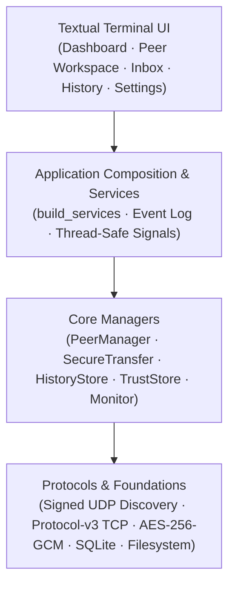
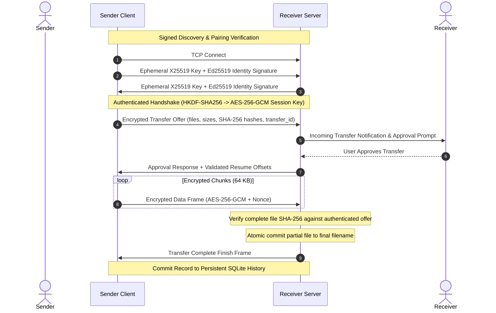

# Mesh-Pulse

[](https://www.python.org/)
[](LICENSE)
[](https://github.com/radikonreturn/mesh_pulse/actions/workflows/python-app.yml)

Mesh-Pulse is a terminal-first local network workspace for discovering trusted peers, monitoring their availability, and transferring files securely without cloud accounts, third-party infrastructure, or external servers.

It pairs cryptographic peer identity with an interactive Textual interface, giving developers and system administrators full LAN visibility and direct encrypted transfers from the console.

---

## Key Features

- **Signed Peer Discovery**: Automatic local network discovery via UDP broadcast beacons signed with persistent Ed25519 device keys and protected against replay attacks.
- **Trusted Device Pairing**: Public keys derived directly into stable device IDs; compare human-readable fingerprints to pair devices explicitly.
- **Authenticated Sessions (Protocol v3)**: Mutual ephemeral X25519 key exchange signed by device identities, deriving transcript-bound session keys via HKDF-SHA256.
- **Encrypted Streaming**: Files stream over TCP using AES-256-GCM chunk framing with unique per-chunk nonces.
- **Interactive Transfer Approval**: Receivers review incoming transfer offers (files, sizes, sender identity) in a dedicated inbox modal before any data is written.
- **Resumable Transfers**: Interrupted transfers automatically resume from verified byte offsets without re-transmitting existing chunks.
- **Cryptographic Integrity & Atomic Commit**: Completed transfers are verified against an end-to-end SHA-256 hash before atomic commit into the receive directory, preventing file corruption or silent overwrites.
- **Transfer History**: Persistent local SQLite database records all transfer events, throughput, file counts, and statuses with per-peer filtering.
- **Network Intelligence**: Bounded peer observations track availability states (`ONLINE`, `STALE`, `OFFLINE`), measured TCP round-trip latencies, and explainable health metrics.
- **Offline Demo Mode**: Isolated showcase workspace (`mesh-pulse --demo`) using temporary in-memory state without broadcasting on the local network.
- **Legacy Compatibility**: Optional, explicit legacy mode (`--key`) supporting passphrase-derived symmetric transfers with protocol-v2 peers.

---

## Why Mesh-Pulse?

| | Mesh-Pulse | Syncthing | scp / rsync | LocalSend |
|---|---|---|---|---|
| Primary use | Ad-hoc LAN transfers + peer/network visibility | Continuous folder synchronization | Scripted/manual remote file transfer | Simple GUI-based local file sharing |
| Interface | Terminal TUI | Web UI | CLI | GUI |
| Peer discovery | Automatic LAN discovery | Automatic | Usually manual host/IP | Automatic |
| Trusted device identity | Yes | Yes | SSH host/key model | Device approval / TLS-based |
| Incoming transfer approval | Yes | Not the same interaction model | No interactive receiver inbox by default | Yes |
| Resumable transfers | Yes | Yes | Depends on tool/options | Implementation-dependent |
| Transfer history | Built-in SQLite history | Synchronization/event history | Not built in | Limited |
| LAN health / latency view | Built in | No | No | No |
| Cloud account required | No | No | No | No |
| Best fit | Terminal users who want peer visibility + secure ad-hoc transfer | Keeping folders synchronized | Automation, SSH workflows, servers | Easy non-technical file sharing |

Mesh-Pulse is not intended to replace continuous synchronization tools or SSH-based automation. Its niche is a terminal-first LAN workspace where peer discovery, trust, availability, transfer approval, encrypted ad-hoc file transfer, and transfer history live in one interface.

---

## Architecture

Mesh-Pulse separates presentation, orchestration, core domain logic, and cryptographic protocol framing:



---

## Transfer Protocol Flow

Standard Protocol-v3 transfer lifecycle:



---

## Installation

Mesh-Pulse requires Python 3.10, 3.11, 3.12, or 3.13.

### Option 1: Install via pip

```bash
pip install mesh-pulse
```

### Option 2: Install via pipx (Recommended for CLI use)

```bash
pipx install mesh-pulse
```

Or from a local clone:

```bash
pipx install .
```

### Option 3: Standalone Executable

Pre-compiled standalone binaries that do not require an existing Python installation are available from the GitHub Releases page:
- **Windows (x64)**: `mesh-pulse-windows-x64.zip` (extract and run `mesh-pulse.exe`)
- **Linux (x64)**: `mesh-pulse-linux-x64.tar.gz` (extract and run `mesh-pulse`)

### Option 4: Local Development Clone

```bash
git clone https://github.com/radikonreturn/mesh_pulse.git
cd mesh_pulse
python -m venv .venv
source .venv/bin/activate   # On Windows PowerShell: .\.venv\Scripts\Activate.ps1
pip install -r requirements.txt
pip install -e .
```

---

## Quick Start

### 1. Launch Mesh-Pulse

Run the command in your terminal:

```bash
mesh-pulse
```

Or execute directly through Python:

```bash
python -m mesh_pulse
```

### 2. Try Showcase / Demo Mode

To explore the user interface without broadcasting across your local network:

```bash
mesh-pulse --demo
```

Demo mode uses an ephemeral temporary directory, loads realistic mock peers across different availability states, and simulates pending and historical transfers.

---

## Keyboard Shortcuts

| Shortcut | Action | Description |
| :--- | :--- | :--- |
| `S` | **Send File** | Open file picker to transmit files or directories to a peer |
| `Enter` / `P` | **Peer Detail** | Inspect selected peer metrics, trust state, latency, and transfer stats |
| `I` | **Inbox** | Review, accept, or reject incoming authenticated transfer offers |
| `H` | **History** | Browse persistent SQLite transfer history across all sessions |
| `G` | **Settings** | View local Ed25519 identity, fingerprint, and configured paths |
| `O` | **Open Received** | Open the local incoming files directory in the system file manager |
| `C` | **Cancel Transfer** | Cancel the most recent active outgoing transfer |
| `R` | **Refresh** | Request immediate UI refresh and telemetry update |
| `D` | **Toggle Theme** | Switch between dark and light color palettes |
| `Q` | **Quit** | Gracefully disconnect active workers and exit |

---

## Configuration

Mesh-Pulse resolves configuration in the following order of precedence:
1. Command-line flags
2. Environment variables
3. User configuration file (`~/.mesh_pulse_config.json`)
4. Built-in defaults

### Command-Line Options

```text
Usage: mesh-pulse [OPTIONS]

Options:
  --broadcast-port INTEGER  UDP discovery port (default: 37020)
  --transfer-port INTEGER   TCP transfer port (default: 5000)
  --demo                    Run an isolated showcase workspace without network traffic
  --key TEXT                Enable explicit legacy v2 transfers with a shared passphrase
  --version                 Show the version and exit
  --help                    Show this message and exit
```

### Environment Variables

| Variable | Default | Purpose |
| :--- | :--- | :--- |
| `MESH_PULSE_BCAST_PORT` | `37020` | UDP port for discovery beacons |
| `MESH_PULSE_XFER_PORT` | `5000` | TCP port for authenticated file transfers |
| `MESH_PULSE_RECEIVE_DIR` | `~/mesh_pulse_received` | Target folder for accepted inbound files |
| `MESH_PULSE_KEY` | *(None)* | Shared passphrase for legacy v2 interoperability |

---

## Security Model

Mesh-Pulse assumes the local host filesystem and user account are trusted, while treating all network packets, protocol frames, and remote peers as untrusted.

- **Identity**: Each device generates an Ed25519 keypair on first run. Device IDs are deterministically derived from public keys (`device_id_from_public_key`).
- **Pairing**: Trust is an explicit local decision. An operator compares public-key fingerprints before approving a peer.
- **Fresh Session Keys**: For every transfer connection, both peers generate ephemeral X25519 keypairs, sign them with their Ed25519 identities, and compute a shared secret expanded with HKDF-SHA256 into a 256-bit AES-GCM session key.
- **Defense in Depth**: Filenames are strictly sanitized to prevent path traversal; reserved device names (e.g., `CON`, `NUL`, `COM1`), control characters, and path separators are rejected.
- **Integrity**: Files stream into hidden partial files (`.<transfer_id>_<file_id>.part`) and are committed atomically only after full SHA-256 verification. Existing files are never silently overwritten without collision avoidance.

For an exhaustive technical specification of cryptographic bounds, replay protections, and threat assumptions, see [docs/security.md](docs/security.md).

---

## UI Screenshots

Screenshots of Mesh-Pulse running in a terminal:

| Dashboard View | Peer Detail Workspace |
| :---: | :---: |
| *Main dashboard monitoring local peers and transfers* | *Detailed peer metrics, trust status, and transfer statistics* |

| Incoming Transfer Inbox | Persistent History |
| :---: | :---: |
| *Interactive approval prompt for incoming files* | *Searchable SQLite history of completed and interrupted transfers* |

*(Reference images and visual assets are located in [`docs/images/`](docs/images/).)*

---

## Development & Testing

Run tests and style linters:

```bash
# Execute pytest suite
pytest -q

# Run Ruff linter and formatting checks
ruff check .
ruff format --check .

# Build distribution packages
python -m build

# Build standalone executables
python scripts/build_standalone.py
```

See [CONTRIBUTING.md](CONTRIBUTING.md) for detailed guidelines.

---

## Known Limitations

- **Local Area Networks**: Discovery relies on UDP broadcast packets and requires peers to be connected to the same Layer 2 / Layer 3 broadcast domain. Internet routing, NAT traversal, and cloud relaying are explicitly out of scope.
- **Bandwidth**: Encryption and checksum verification throughput depend on host CPU capabilities.

---

## License

Mesh-Pulse is released under the [MIT License](LICENSE).
